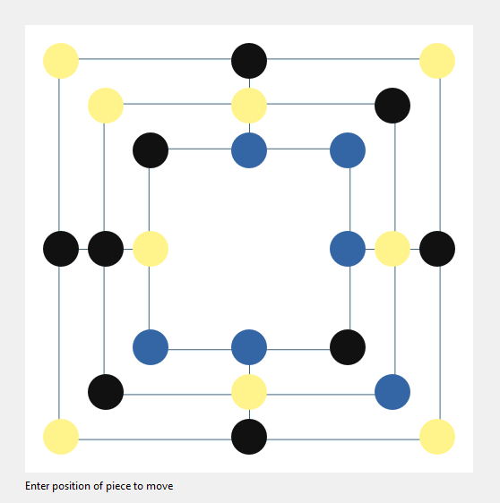

# Sudoku

## Description

This is a Nine men's morris mini-game written in Python which comes with a friendly GUI developed with Qt Framework.

## Usage 

When you open the app, you will be greeted with an empty board that you have to fill with your 9 pieces and then move them around to create morrises and take your opponent's pieces to eventually win. Check out the rules of the game [here](https://en.wikipedia.org/wiki/Nine_men%27s_morris) .